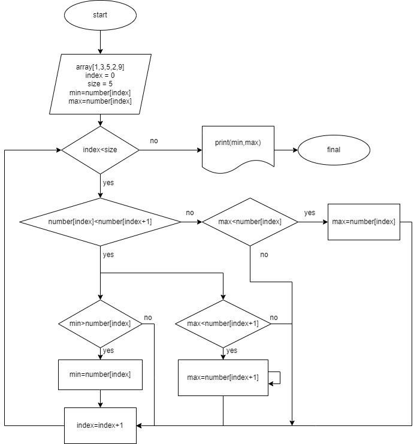

Выделить заголовок -- поставить перед строкой от одной до шести решёток `#`. Чем больше решёток, тем ниже уровень заголовка.

# Титульный заголовок первого порядка
## Заголовок второго порядка

Выделить `элемент кода` -- поставить один или больше обратных апострофов `` ` ``в начале и конце.

Экранировать символ -- поставить перед ним обратную косую черту `\`

Выделить цитату -- поставить закрывающую угловую скобку `>` в начале строки:
> Это цитата
>
> Это продолжение цитаты

Выделить *курсивом* -- поставить одну звёздочку `*` в начале и конце.
*Курсив*

Выделить **жирным** -- поставить две звёздочки `**` в начале и конце. А также: __Жирный шрифт__

Выделить ***жирным курсивом*** поставить три звёздочки `***` в начале и конце.  

***жирный курсив***

Зачеркнутый шрифт можно сделать при вставке ~~ в начале и в коцне слова\предложения, которое необходимо зачеркнуть.

Например:
~~зачеркнутый~~

Ненумированный список
* первая строка
* вторая строка

Номерной список:
1. Первая строка
2. Вторая строка

Для того, чтобы __добавить изображение__ ,  необходимо поставить восклицательный знак **!**. После него поставить **квадратные скобки** [] и написать в нем название изображения.
После них поставить **круглые скобки** () и в них написать имя файла изображения с форматом.

Например: ! [ Изображение _ блок - схемы ](Задание1. png) - пробелы не ставить!

Для того, чтобы начать работать с удаленными репозиториями, необходимо зарегестрироваться на сайте https://github.com . После этого необходимо связать установленный Git c GitHub.

Как настроить совместную работу:
1. Создать аккаунт на GitHub.com
2. Создать локальный репозиторий
3. “Подружить” ваш локальный и удалённый репозитории. 
 GitHub при создании нового репозитория подскажет, как это можно сделать
 
 git remote add origin https://github.com/Oddenweird/-.git

git branch -M main

git push -u origin main

4. Отправить (push) ваш локальный репозиторий в удалённый (на GitHub), при этом, возможно, 
вам нужно будет авторизоваться на удалённом репозитории
5. Провести изменения “с другого компьютера”
6. Выкачать (pull) актуальное состояние из удалённого репозитория